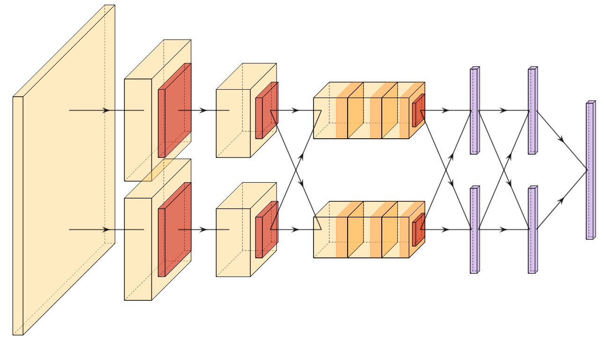

# Model Catalog

Highlighting some of the most interesting and impactful neural network architectures through history.



## Requirements


Trying to build the largest catalog of neural network architectures throughout history with the [Burn](https://burn.dev) deep learning framework.

```
[dependencies]
burn = { version = "0.12.1", features = ["train", "wgpu", "vision"] }
clap = { version = "4.5.3", features = ["derive"] }
```

## Overview

`cargo run -- <task> <phase> <options>`

- `task` &mdash; [classification|~~regression~~]
- `phase` &mdash; [training|inference]

```
cargo run -- classification training <options>
Options:
  -d, --dataset <DATASET>        [mnist|cifar]
  -m, --model <MODEL>            [lenet|alexnet]
      --epochs <EPOCHS>          [default: 10]
      --batch-size <BATCH_SIZE>  [default: 128]
  -o, --optimizer <OPTIMIZER>    [sgd|adam] [default: sgd]
      --lr <LR>                  [default: 0.01]
      --wd <WD>                  [default: 0.0005]
      --momentum <MOMENTUM>      [default: 0.9]
      --schedule <SCHEDULE>      [constant|cosine] [default: cosine]
  -h, --help                     Print help
```


## Models

- [x] LeNet (1985)
- [x] AlexNet (2012)